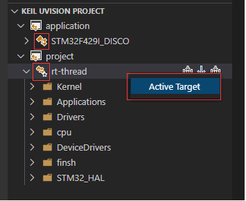
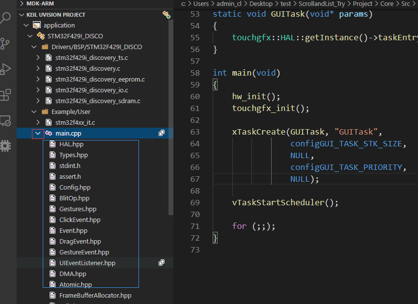

# Keil Assistant

                

## [English](./README_EN.md)

## 简述 📑

vscode 上的 Keil 辅助工具，与 c/c++ 插件配合使用，为 Keil 项目提供 `语法高亮`、`代码片段` 的功能，并通过使用 `Keil 命令行功能`进行 `编译`、`下载`。

**支持 Keil uVison 5 ，其他版本未做过测试**  

**仅支持 Windows 平台**

***

## 语法扩展

* 8051 汇编(A51) 语法高亮，代码片段

***

***

## 用法 📖

### 准备工作

1. 安装 C/C++ 插件
> 
2. 进入 Keil-Assistant 插件设置，设置好 keil 可执行文件的绝对路径，否则编译等功能将无法使用

***

### 开始 🏃‍♀️

1. 在 Keil 上创建好项目，添加好文件，头文件路径等
> 
2. 点击`打开项目`图标 或者 使用 vscode 直接打开 keil 项目文件(.uvproj) 所在的目录，keil-assistant 会自动完成加载 keil 项目；

3. 点击源文件开始你的代码编辑，点击 build/rebuild 按钮完成项目的编译/重新编译

4. 点击目标名称在多个 c/c++ 配置中切换

5. 右键菜单点击 Active Target 将快捷键绑定到该 Keil Target 上

6. 在编译完成后，可以点击源文件项的箭头图标展开其引用（仅支持 MDK 项目）

***

## 工作特性 🎉

* 插件会读取的 Keil 配置有：文件结构，头文件目录，宏列表
* 每当 Keil 项目文件发生变化，插件就会自动更新 vscode 对应的视图，以及 C/C++ 插件的头文件配置
* 编译等功能使用 keil 命令行直接调用

## 注意事项 🚩

* **.uvproj** 对应 Keil C51 项目，**.uvprojx** 对应 Keil MDK 项目
* **由于 Keil 只会在关闭时写入项目文件，因此在如果在更改完项目结构之后要刷新到插件，则需要关闭 Keil**
