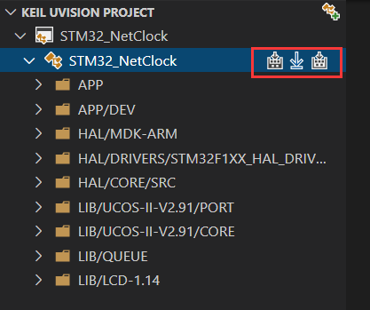
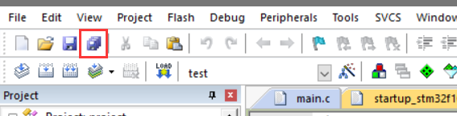
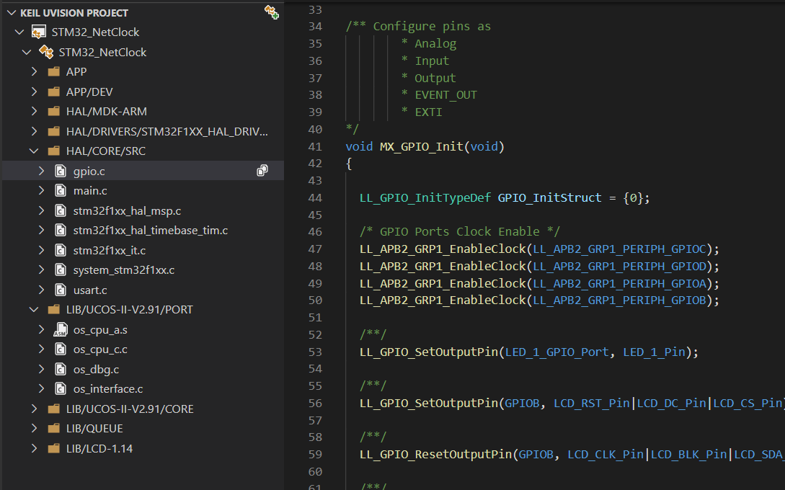

# Keil Assistant

[](https://marketplace.visualstudio.com/items?itemName=CL.keil-assistant)      [](https://marketplace.visualstudio.com/items?itemName=CL.keil-assistant)     [](https://marketplace.visualstudio.com/items?itemName=CL.keil-assistant)     [](https://marketplace.visualstudio.com/items?itemName=CL.keil-assistant)

## [English](./README_EN.md)

## 简述 📑

vscode 上的 Keil 辅助工具，与 c/c++ 插件配合使用.

能够为 Keil 项目提供 语法高亮、代码片段 的功能，并支持对 keil 项目进行 编译、下载。

**仅支持 Keil uVison 5 及以上版本**  

**仅支持 Windows 平台**


***

## 功能特性🎉

- 加载 Keil C51/ARM 项目，并以 Keil 项目资源管理器的展示方式显示项目视图
- 自动监视 keil 项目文件的变化，及时更新项目视图
- 通过调用 Keil 命令行接口实现 编译，重新编译，烧录 keil 项目
- 自动生成 c_cpp_properties.json 文件，使 C/C++ 插件的语法分析能正常进行

***

## 用法 📖

### 准备工作

1. 安装 C/C++ 插件
>
2. 进入 Keil-Assistant 插件设置，设置好 keil 可执行文件 UV4.exe 的绝对路径
 

***

### 开始使用 🏃‍♀️

1. 在 Keil 上创建好项目，添加好文件，头文件路径等
> 
2. 点击 **打开项目** 图标 或者 **使用 vscode 直接打开 keil 项目文件(.uvproj) 所在的目录**，插件会自动加载 keil 项目；
 

### 常用操作

- **编译，烧录**：提供了 3 个按钮，分别代表 编译，下载，重新编译
 

>

- **保存和刷新**：在 Keil 上添加/删除源文件，更改，配置项目，更改完毕后点击 **保存所有**，插件检测到 keil 项目变化后会自动刷新项目
 

>

- **打开源文件**：单击源文件将以预览模式打开，双击源文件将切换到非预览模式打开
 

>

- **切换 c/c++ 插件的配置**：点击目标名称在多个 c/c++ 配置中切换
 

>

- **切换 keil Target**：点击项目的切换按钮，可以在多个 Keil Target 之间切换
 

>

- **展开引用**：在编译完成后，可以点击源文件项的箭头图标展开其引用（仅支持 ARM 项目）
 

***

### 其他设置

- 工作区设置：项目排除列表(`KeilAssistant.Project.ExcludeList`)
 当某个目录下存在多个 keil 项目时，使用插件打开该目录，插件会加载所有的 keil 项目，通过此选项，可以指定需要排除哪些 keil 项目，防止在打开该工作区时自动加载该项目
 **默认的排除列表**：
  ```json
  [
      "template.uvproj",
      "template.uvprojx"
  ]
  ```

### 还有其他问题 ？

可以到以下位置进行交流

- [论坛: https://discuss.em-ide.com/t/keil-assistant](https://discuss.em-ide.com/t/keil-assistant)

- [Github Issue: https://github.com/github0null/keil-assistant/issues](https://github.com/github0null/keil-assistant/issues)