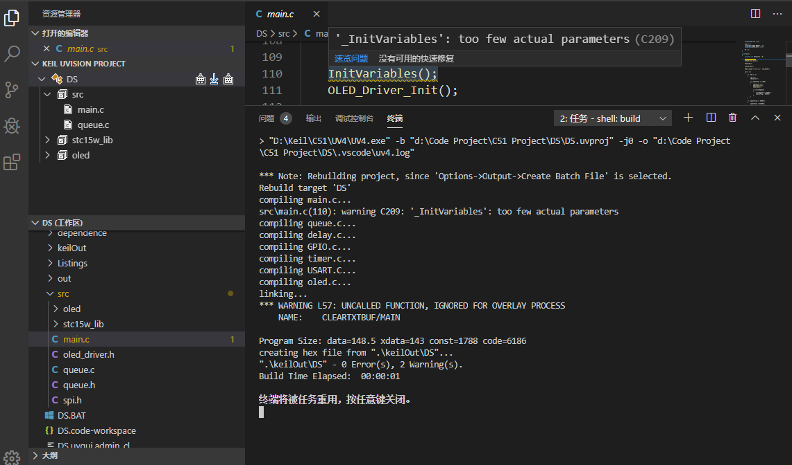
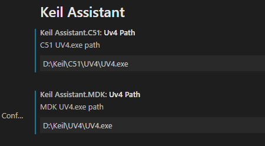
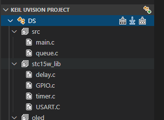
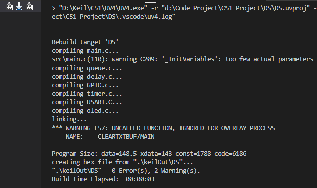

# Keil Assistant

                

## Summary 📑

vscode on the Keil auxiliary tool, for Keil project to provide `syntax highlighting`, `code fragment` function, and through the use of `Keil command line function` to `compile`, `download`.

**Support for Keil uVison 5, no other version has been tested**  

**Windows platform only**

***

## Syntax support

* 8051 Assembly (A51) syntax highlights, code snippets

***

***

## Usage 📖

### Preparatory work

1. Install C/C++ extension
> 
2. Go to the Keil-Assistant plug-in Settings and set the absolute path to the keil executable, otherwise features such as compilation will not be available

***

### Start 🏃‍♀️

1. Create a project on Keil, add files, header paths, etc
> 
2. Open the directory where the project file (.uvproj) resides by vscode，and keil-assistant will Load keil project automatically;

> 
3. Click on the source file to start your code editing，Click build/rebuild Button to complete the compile/recompile of the project

***

## Work feature 🎉

* The Keil configuration that the plug-in will read is: file structure, header directory, and macro list
* Whenever the Keil project file changes, the plug-in automatically updates the view corresponding to vscode, as well as the header file configuration of the C/C++ plug-in
* Functions such as compilation are called directly from the keil command line

## Attention 🚩

* **.uvproj** corresponds to Keil C51 project，**.uvprojx** corresponds to Keil MDK project
* Since Keil only writes to the project file when closed, you need to close Keil if you want to refresh to the plug-in View after changing the project structure